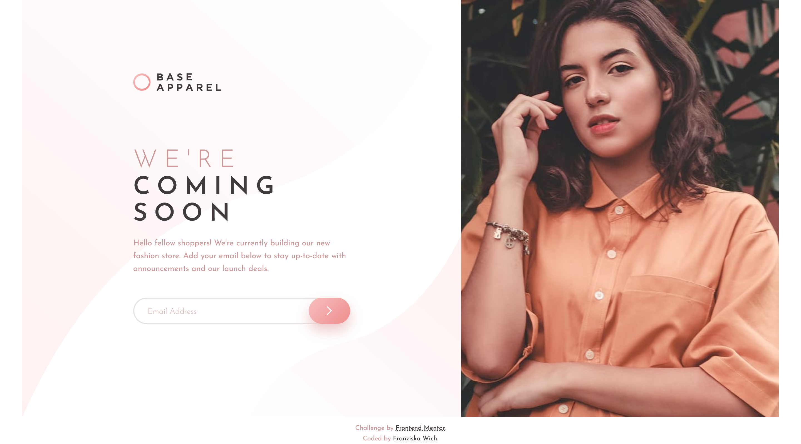

# Frontend Mentor - Base Apparel coming soon page solution

This is a solution to the [Base Apparel coming soon page challenge on Frontend Mentor](https://www.frontendmentor.io/challenges/base-apparel-coming-soon-page-5d46b47f8db8a7063f9331a0). Frontend Mentor challenges help you improve your coding skills by building realistic projects.

## Table of contents

- [Overview](#overview)
  - [The challenge](#the-challenge)
  - [Screenshot](#screenshot)
  - [Links](#links)
- [My process](#my-process)
  - [Built with](#built-with)
  - [What I learned](#what-i-learned)
  - [Continued development](#continued-development)
  - [Useful resources](#useful-resources)
- [Author](#author)

## Overview

### The challenge

Users should be able to:

- View the optimal layout for the site depending on their device's screen size
- See hover states for all interactive elements on the page
- Receive an error message when the `form` is submitted if:
  - The `input` field is empty
  - The email address is not formatted correctly

### Screenshot

### Links

- Solution URL: [https://github.com/franziskawich/base-apparel-coming-soon](https://github.com/franziskawich/base-apparel-coming-soon)
- Live Site URL: [https://franziskawich.github.io/base-apparel-coming-soon/](https://franziskawich.github.io/base-apparel-coming-soon/)

## My process

### Built with

- Semantic HTML5 markup
- CSS custom properties (SCSS)
- JavaScript
- Flexbox
- BEM
- Mobile-first workflow

### What I learned

I learned how to insert a simple email validation using JS and some basics about creating forms using an MDN guide for web forms.

### Continued development

When typing a longer email address in the input field on a smaller device, the text is hidden behind the button. I checked if it is possible to insert a line break, but according to Stack Overflow line breaks are only possible with the `<textarea>` element.

I am not so happy with the layout between 600px and 740px, I don't like the position of the image. That could definitly be improved. I notice that I quite often struggle with the tablet layouts to make them look reasonably appealing.

I only included the background image for larger display sizes, otherwise it always looked weird. There is probably a way to embed the background image so that it looks perfect on every display, but I haven't not figure it out today.

For larger screens, I removed my header image and added it to the main content instead to achieve the desired layout. Although it worked well, it feels wrong somehow. There is probably a more effient way to do that too.

### Useful resources

- [Aditus: aria-label](https://www.aditus.io/aria/aria-label/) - This resource helped me to correctly use an aria-label for my submit button, which did not contain any text.
- [JavaScript: HTML Form - email validation](https://www.w3resource.com/javascript/form/email-validation.php) - I used the regular expression there to check the email input.
- [MDN guide: Web forms - Working with user data](https://developer.mozilla.org/en-US/docs/Learn/Forms) - This helped me with the small form with the email input field.

## Author

- Frontend Mentor - [@franziskawich](https://www.frontendmentor.io/profile/franziskawich)
- freeCodeCamp - [Franziska Wich](https://www.freecodecamp.org/franziska-wich)
